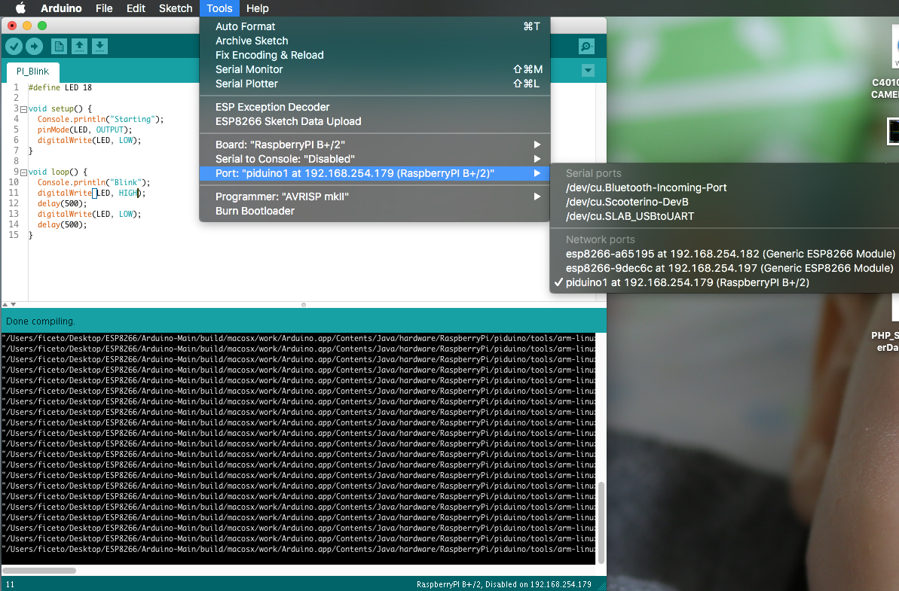
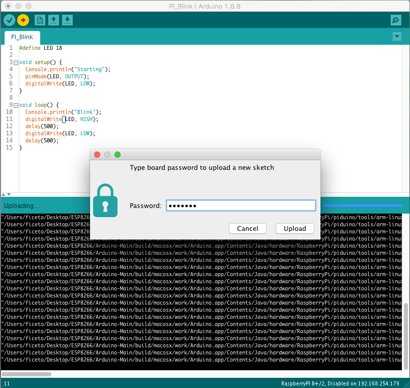
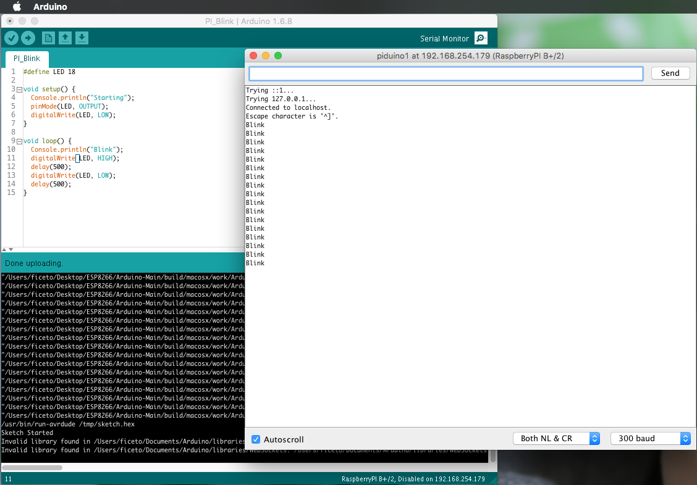

# RasPiArduino [](https://travis-ci.org/me-no-dev/RasPiArduino)

[](https://gitter.im/me-no-dev/RasPiArduino?utm_source=badge&utm_medium=badge&utm_campaign=pr-badge&utm_content=badge)

## Arduino Framework for RaspberryPI
### Features
- The familiar Arduino API
- pinMode/digitalRead/digitalWrite/analogWrite
- Full SPI, Wire and Serial compatibility
- Access to STDIN/STDOUT through the Console class
- Access to system tty through the TTY library
- Process, FileIO, Client, Server and UDP implementations through the Bridge library

### Instructions for Arduino IDE
* Open the installation folder of Arduino IDE
* Create a folder named "RaspberryPi" inside "hardware" and clone the repository to a folder named "piduino"
```bash
mkdir hardware/RaspberryPi
cd hardware/RaspberryPi
git clone https://github.com/me-no-dev/RasPiArduino piduino
```
* Download , extract and copy the toolchain to piduino/tools/arm-linux-gnueabihf
  - Windows: [gnutoolchains.com](http://gnutoolchains.com/raspberry/)
    * The toolchain for Jessie will work ONLY on RaspberryPi 2
    * The toolchain for Wheezy will work on ALL RaspberryPi boards (recommended)
    * [Video Instructions](https://www.youtube.com/watch?v=lZvhtfUlY8Y)
  - Linux 64: [arm-linux-gnueabihf](https://github.com/me-no-dev/RasPiArduino/releases/download/0.0.1/arm-linux-gnueabihf-linux64.tar.gz)
  - Linux 32: [arm-linux-gnueabihf](https://github.com/me-no-dev/RasPiArduino/releases/download/0.0.1/arm-linux-gnueabihf-linux32.tar.gz)
  - Mac OS X: [arm-linux-gnueabihf](https://github.com/me-no-dev/RasPiArduino/releases/download/0.0.1/arm-linux-gnueabihf-osx.tar.gz)
* Restart Arduino IDE and select the RaspberryPI from the list of boards
* Compile a sketch
* Select the RespberryPi from the list of Ports (will show the IP address)
* Upload your sketch and see it go


### Instructions for the PI
* Install Raspbian Jessie on your RaspberryPI
* Gain root permissions
```bash
sudo su
```

* Enable password login for root
```bash
passwd
```
  - _enter the new root password twice_
```bash
sed -i "s/PermitRootLogin without-password/PermitRootLogin yes/" /etc/ssh/sshd_config
```

* Disable Serial Console on boot by changing /boot/cmdline.txt to
```bash
cat > /boot/cmdline.txt <<EOL
dwc_otg.lpm_enable=0 console=tty1 root=/dev/mmcblk0p2 rootfstype=ext4 elevator=deadline fsck.repair=yes rootwait
EOL
```

* Disable Serial tty
```bash
systemctl disable serial-getty@ttyAMA0
```

* Disable loading sound kernel module
```
sed -i "s/dtparam=audio=on/#dtparam=audio=on/" /boot/config.txt
```

* Change the hostname for your Pi (optional)
```bash
hostnamectl set-hostname piduino
```

* Setup WiFi (optional)
```bash
cat > /etc/wpa_supplicant/wpa_supplicant.conf <<EOL
ctrl_interface=DIR=/var/run/wpa_supplicant GROUP=netdev
update_config=1
network={
    ssid="your-ssid"
    psk="your-pass"
}
EOL
```

* Setup avahi service to allow updating the sketch from ArduinoIDE
```bash
cat > /etc/avahi/services/arduino.service <<EOL
<?xml version="1.0" standalone='no'?><!--*-nxml-*-->
<!DOCTYPE service-group SYSTEM "avahi-service.dtd">
<service-group>
  <name replace-wildcards="yes">%h</name>
  <service>
    <type>_arduino._tcp</type>
    <port>22</port>
    <txt-record>board=bplus</txt-record>
  </service>
</service-group>
EOL

service avahi-daemon restart
```

* Install telnet and git
```bash
apt-get update
apt-get install telnet git
```

* Copy all files from tools/arpi_bins to /usr/local/bin
```bash
git clone https://github.com/me-no-dev/RasPiArduino.git piduino
chmod +x piduino/tools/arpi_bins/*
cp piduino/tools/arpi_bins/* /usr/local/bin
rm -rf piduino
```

* Create symbolic link for _run-avrdude_
```bash
ln -s /usr/local/bin/run-avrdude /usr/bin/run-avrdude
```

* Synchronize time and start sketch on boot (optional)
```bash
apt-get install ntpdate
cat > /etc/rc.local <<EOL
#!/bin/sh -e

_IP=\$(hostname -I) || true
if [ "\$_IP" ]; then
  printf "My IP address is %s\n" "\$_IP"
fi

# Sync Time
ntpdate-debian -u > /dev/null
# Start Sketch
/usr/local/bin/run-sketch > /dev/null

exit 0
EOL
```

* Prevent some RealTek USB WiFi from sleep (optional) (EU)
```bash
echo "options 8192cu rtw_power_mgnt=0 rtw_enusbss=1 rtw_ips_mode=1" > /etc/modprobe.d/8192cu.conf
echo "options r8188eu rtw_power_mgnt=0 rtw_enusbss=1 rtw_ips_mode=1" > /etc/modprobe.d/r8188eu.conf
```

* Disable screen blank (optional)
```bash
sed -i "s/BLANK_TIME=30/BLANK_TIME=0/" /etc/kbd/config
sed -i "s/POWERDOWN_TIME=30/POWERDOWN_TIME=0/" /etc/kbd/config
```

* Do not load I2C UART or SPI kernel drivers

* reboot


### If everything went well
#### Selecting the board from the list of ports


#### Password prompt before upload


#### Monitoring the sketch



### Links to external tutorials
* [VIDEO: Setup Arduino IDE for Windows](https://www.youtube.com/watch?v=lZvhtfUlY8Y)
